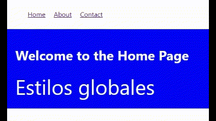

# Ejercicios de práctica
## Importante
Todas las entregas deben realizarse en el foro de tarea correspondiente en el campus de inove, salvo especificarse lo contrario.

## Preparar nuestro entorno de trabajo
Para poder realizar este ejercicio deberá crear un proyecto nuevo, o aprovechar otro que haya utilizado para otro desafio.

## Consigna
En este ejercicio, vamos a practicar el uso de CSS Modules en React para aplicar estilos diferentes en dos componentes, sin que se pisen con los estilos globales de la aplicación. Además, utilizaremos React Router Dom para crear un menú de navegación y mostrar distintos componentes al navegar por las rutas.

Paso a paso:

1. Crea un nuevo proyecto de React utilizando create-react-app.
2. Instala las dependencias necesarias para React Router Dom:

<code>npm install react-router-dom</code>

3. Crea los siguientes tres componentes dentro de la carpeta src/components:

- Home.js:

```javascript
import styles from "./home.module.css";

export default function Home() {
  return (
    <div className={styles.container}>
      <h1>Welcome to the Home Page</h1>
      <span className={styles.span}>Estilos Modulares</span>
    </div>
  );
}
```

- About.js:

```javascript
import styles from "./about.module.css";

export default function About() {
  return (
    <div className={styles.container}>
      <h1 className={styles.h1}>About Us</h1>
      <span>Estilos Modulares</span>
    </div>
  );
}
```

- Contact.js:

```js
import styles from "./contact.module.css";

export default function Contact() {
  return (
    <div className={styles.container}>
      <h1 className={styles.h1}>Contact Us</h1>
      <span className={styles.span}>Estilos Modulares</span>
    </div>
  );
}
```

4. Crea los archivos CSS Modules para cada componente en la misma ubicación que los 3 componentes anteriormente mencionados. Guarda el archivo de Css Modules junto al componente en una carpeta con el mismo nombre del componente.

- about.module.css:

```css
.container {
  background-color: red;
  padding: 20px;
}
.h1 {
  color: grey;
  text-transform: uppercase;
}
```

- contact.module.css:

```css
.container {
  background-color: green;
  padding: 20px;
  font-style: italic;
}
.h1 {
  color: peru;
  margin-left: 50px;
}
.span {
  font-size: 15px;
  font-weight: bold;
  border: 3px dotted white;
}
```

5. En App.js arma la navegación.

```js
import {
  BrowserRouter as Router,
  Route,
  Routes,
  NavLink,
} from "react-router-dom";
import "./App.css";
import Home from "./components/home/Home.jsx";
import About from "./components/about/About";
import Contact from "./components/contact/Contact";
function Nav() {
  return (
    <header>
      <nav>
        <ul>
          <li>
            <NavLink to='/'>Home</NavLink>
          </li>
          <li>
            <NavLink to='/about'>About</NavLink>
          </li>
          <li>
            <NavLink to='/contact'>Contact</NavLink>
          </li>
        </ul>
      </nav>
    </header>
  );
}
export default function App() {
  return (
    <Router>
      <Nav />
      <Routes>
        <Route path='/' element={<Home />} />
        <Route path='/about' element={<About />} />
        <Route path='/contact' element={<Contact />} />
      </Routes>
    </Router>
  );
}
```

6. Home.jsx solo recibe los estilos globales. About.jsx y Contact.jsx deben recibir estilos modularizados. Solo el span de About.jsx debe ser un estilo global.

## Resultado final


