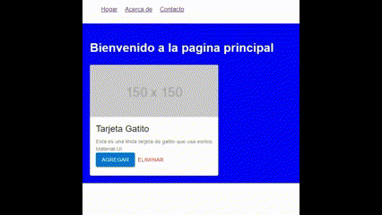

# Ejercicios de práctica
## Importante
Todas las entregas deben realizarse en el foro de tarea correspondiente en el campus de inove, salvo especificarse lo contrario.

## Preparar nuestro entorno de trabajo
Para poder realizar este ejercicio deberá crear un proyecto nuevo, o aprovechar otro que haya utilizado para otro desafio.

## Consigna
Crear una aplicación de React con tres páginas: Home, About y Contact. Cada página mostrará una tarjeta básica de Material-UI y módulos CSS. Se utilizará react-router-dom para establecer las rutas entre las páginas.

Paso a paso:

1. Configuración del proyecto:

Crea un nuevo proyecto de React utilizando Create React App.
Abre el directorio del proyecto en tu editor de código preferido.
Instala las dependencias adicionales necesarias: @mui/material y react-router-dom.

2. Creación de la estructura del proyecto:

Crea una carpeta llamada "components" dentro del directorio "src".
Dentro de la carpeta "components", crea tres archivos: "Home.jsx", "About.jsx" y "Contact.jsx".
Crea un archivo "App.js" en el directorio "src".

3. Configuración de las rutas:

Importa BrowserRouter, Route y Routes del paquete "react-router-dom" en "App.js".
Crea un componente de navegación llamado "Nav" en "App.js" para mostrar los enlaces de navegación entre las páginas.
Crea las rutas utilizando los componentes Route y Routes en "App.js", asignando una ruta y un componente a cada página.

4. Estilos con Material-UI y módulos CSS:

En la carpeta "components", crea un archivo CSS para cada componente (por ejemplo, , "about.module.css" y "contact.module.css").
En cada archivo CSS, define las clases de estilo necesarias para cada componente. Recuerda seguir las convenciones de nombres de clases únicas.
Importa los estilos CSS en cada componente respectivo (por ejemplo, "import styles from './home.module.css'") y aplica las clases de estilo según sea necesario.

5. Desarrollo de los componentes:

En cada archivo de componente (Home.jsx, About.jsx y Contact.jsx), importa los componentes necesarios de Material-UI y las hojas de estilo CSS correspondientes.
Dentro de cada componente, implementa la estructura del contenido utilizando los componentes de Material-UI.
Utiliza las clases de estilo CSS importadas para aplicar estilos específicos a los elementos del componente.
Personaliza los componentes y sus propiedades según sea necesario para mostrar la información de las tarjetas en cada página.

- Home.jsx:

Define la función del componente Home como un componente funcional de React.
Dentro del componente, crea la estructura del contenido utilizando los componentes de Material-UI, como Card, CardMedia, CardContent, Typography y Button.
Utiliza las clases de estilo CSS global en este componente.

```css
body {
  font-family: Arial, sans-serif;
  margin: 0;
  padding: 0;
}

nav ul {
  display: flex;
  justify-content: flex-start;
  list-style: none;
}

li {
  margin: 10px;
}

.container {
  background-color: blue;
  padding: 20px;
}
h1 {
  color: white;
}
```

Asegúrate de exportar el componente Home.

- About.jsx:

Define la función del componente About como un componente funcional de React.
Dentro del componente, crea la estructura del contenido utilizando los componentes de Material-UI, como Card, CardMedia, CardContent, Typography y Button.
Utiliza un estilo CSS modular:

```css
.container {
  background-color: red;
  padding: 20px;
}

.h1 {
  color: grey;
  text-transform: uppercase;
}
```

Asegúrate de exportar el componente About.

- Contact.js:

Importa los componentes necesarios de Material-UI y la hoja de estilos CSS.
Define la función del componente Contact como un componente funcional de React.
Dentro del componente, crea la estructura del contenido utilizando los componentes de Material-UI, como Card, CardMedia, CardContent, Typography y Button.
Modifica esta propiedad en esta tarjeta para aumentar el tamaño del título.

```js
     <Typography gutterBottom variant='h3' component='div'>
```

Utiliza un estilo CSS modular:

```css
.container {
  background-color: blue;
  padding: 20px;
}

.h1 {
  color: white;
}
```

Asegúrate de exportar el componente Contact

6. Prueba y ejecución de la aplicación:

Ejecuta el comando "npm start" en la terminal para iniciar la aplicación en el navegador.
Verifica que la aplicación se ejecute correctamente y que las páginas se muestren correctamente con las tarjetas de gatitos y los estilos aplicados.

Recuerda que en cada paso es importante tener en cuenta la estructura de carpetas y archivos, importar las dependencias necesarias y escribir el código adecuadamente. Además, asegúrate de entender cada concepto y cómo se relacionan entre sí para construir una aplicación coherente y funcional.

Aclaración: La tarjeta renderizada de Material UI es la que esta por defecto en el sitio oficial, se le agregó un par de botones.

## Resultado final



